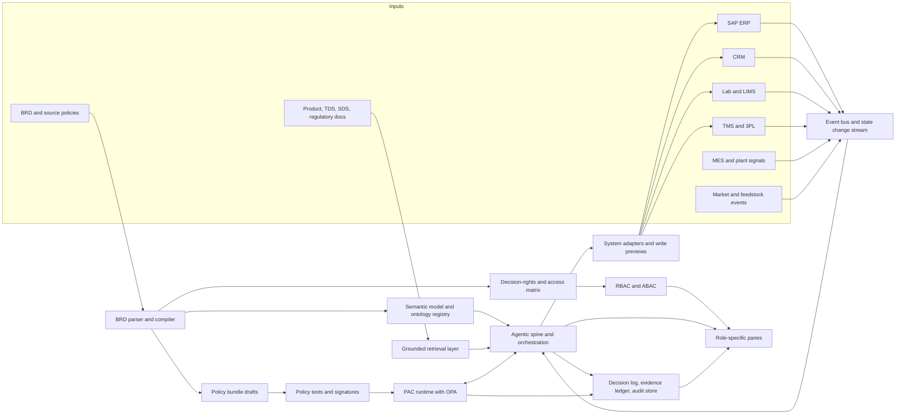
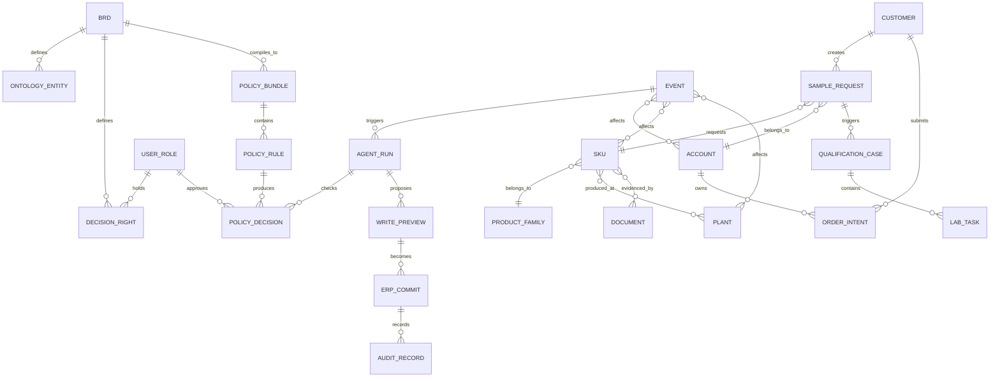
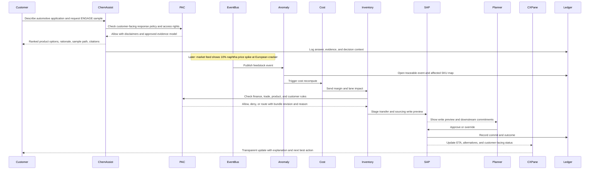
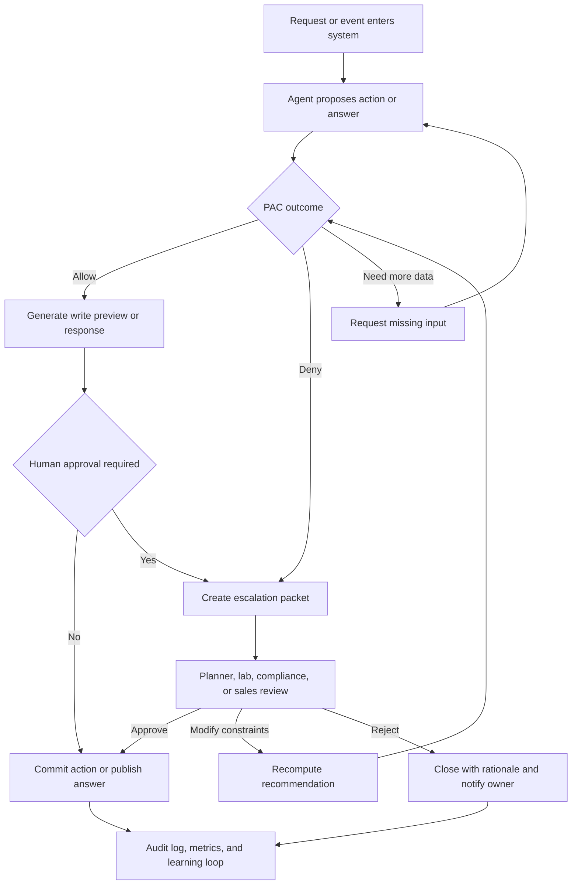

# Reimagining Dow Sample to Ship as a Governed Agentic Orchestration Platform

## Executive summary

Dow’s strongest story is not two separate demos—one for Policy as Code and one for customer experience. It is one governed platform with two surfaces: an internal operational control tower and a customer-facing or seller-facing ChemAssist experience, both powered by the same canonical business graph, policy engine, event spine, and audit ledger. That direction is already implicit in the current BRD, which frames ChemAssist, RegRadar, and the Supply Chain Agentic Spine as one shared AI foundation with PAC checks before controlled actions, human review for bounded autonomy, and full traceability; it is also consistent with the supplied KAF/PAC briefing and the order-to-cash memo that argues for moving from a fragmented ERP transaction chain to an event-driven revenue execution platform. fileciteturn0file0 fileciteturn0file1 fileciteturn0file6 fileciteturn0file7

The design pattern that best fits that ambition is a **semantic single source of truth** with **role-specific panes**, not a single overloaded screen. Dema’s transferable idea is precisely this: one modeled data layer shared by the agent, dashboards, and reports; reusable skills; role-based access; and actions taken from the same surface. OPA then supplies the policy layer: decoupled decisioning, versioned bundles, testable policies, decision logs, and masking. SAP Integration Suite supplies the enterprise integration layer: APIs, event-driven architecture, centralized governance, and hybrid connectivity across SAP and third-party systems. MCP provides a standard way to expose governed tools and workflows to agents, while CloudEvents offers a practical common envelope for cross-system event routing. citeturn20view0turn22view0turn22view2turn22view3turn5view0turn8view0turn26view0turn26view1turn8view3turn10view0turn14view0turn13view0turn24view0turn27view0

For Dow specifically, the experience must be built around the **sample as the first commercial commitment**, not as a detached website form. One of the supplied product-line artifacts already models the value stream as customer experience → sample management → regulatory review → inventory availability → logistics fulfillment → customer testing → technical support → commercial opportunity → revenue. That framing is critical: if the sample request stays detached from qualification, policy, supply, and revenue, the redesign will still feel digital on the surface and fragmented underneath. fileciteturn0file4

The most compelling June 9 demo is therefore a **connected story**. A customer or seller starts with an automotive ENGAGE use case, requests a sample, and sees qualification logic explained in context. Then a naphtha price spike hits a European cracker, the agentic spine detects the event, recomputes cost-to-serve and supply options, checks PAC guardrails, stages ERP changes, routes a planner sign-off, and updates the customer-facing commitment transparently with rationale, impact, and next best action. That is the moment where PAC and CX become one coherent experience rather than parallel concepts. fileciteturn0file1 fileciteturn0file4 fileciteturn0file5

The current BRD is directionally strong, but it is not yet sufficient for this build. It already defines the shared AI foundation, human-in-the-loop action levels, auditability, and initial agent set. What it still needs is a formal semantic-model schema, a decision-rights matrix, a machine-readable explainability contract, a policy promotion pipeline, a backtest lab framework, and deployment gates that explicitly control when internal recommendations can become customer-visible or write back into systems of record. fileciteturn0file0 citeturn26view1turn8view3turn25view0

### Recommended rehearsal build

| Package | What it proves | June 9 fidelity |
|---|---|---|
| **Narrative deck** | PAC and CX are one platform story, not two disconnected stories | Final |
| **Clickable UX prototype** | Four to six key panes across customer, planner, compliance, and backtest lab | High |
| **Executable policy bundle** | At least a narrow set of finance, trade, product, and customer rules actually run | Medium to high |
| **Event replay engine** | The naphtha shock can be replayed deterministically with traceable downstream effects | High |
| **Audit and explainability drawer** | Every recommendation and action shows evidence, policy status, and next owner | High |
| **ERP write-preview adapter** | The demo can show approved write sets without needing risky live writes | Medium |

## Research base and design implications

### Prioritized reference base

| Priority | Source | Why it matters |
|---|---|---|
| High | Dow Agentic Intelligence Platform BRD fileciteturn0file0 | Defines the shared platform vision, PAC, human oversight, modules, phased rollout, metrics, and open questions |
| High | KAF and PAC supply-chain briefing fileciteturn0file1 | Gives the four-agent design, the naphtha-shock reference flow, and the planner sign-off model |
| High | Dow AI Concept Briefs fileciteturn0file7 | Provides the intended ChemAssist and RegRadar use cases and their business case framing |
| High | Reimagining the Order to Cash memo fileciteturn0file6 | Reframes the commercial journey as event-driven orchestration rather than ERP processing |
| High | OPA documentation on Rego, bundles, decision logs, external data, and policy testing citeturn5view0turn8view0turn26view0turn26view1turn26view2turn8view3 | Supplies the concrete implementation pattern for PAC |
| High | SAP Integration Suite and Event Mesh pages citeturn10view0turn14view0turn13view0 | Supplies the official enterprise pattern for APIs, event-driven integration, governance, and hybrid SAP connectivity |
| High | Dema platform, semantic layer, and agent pages citeturn19view0turn20view0turn22view0turn22view1turn22view2turn22view3 | Supplies the strongest practical model for a semantic layer shared by agent, dashboards, and actions |
| Medium | Dow elastomer customer and operating-model artifacts fileciteturn0file3 fileciteturn0file4 | Grounds personas, product ownership, sample-to-revenue flow, and KPIs |
| Medium | Dow ENGAGE automotive selection guide fileciteturn0file5 | Grounds the ENGAGE automotive TPO use case in actual material, process, and regional-selection logic |
| Medium | MCP, NIST AI RMF, and CloudEvents official docs citeturn24view0turn25view0turn27view0 | Support tool interoperability, trustworthy AI controls, and event standardization |

### What the evidence says

The supplied Dow materials already converge on the same conclusion: the company does not need another disconnected AI assistant. It needs a shared control plane that joins customer queries, technical knowledge, regulatory interpretation, and operational execution. The BRD describes exactly that architecture; the concept brief makes the same point by arguing that RegRadar and ChemAssist are stronger together and share a common foundation; and the KAF/PAC supply-chain briefing shows how that same foundation can orchestrate action under policy bounds in near real time. fileciteturn0file0 fileciteturn0file1 fileciteturn0file7

The current commercial journey is still too browse-heavy, document-heavy, and reactive. The ChemAssist brief explicitly says customers today search catalogues manually, download multiple technical and regulatory documents, contact Sales or Technical Service, wait for a response, validate compliance separately, and move through separate sample, quote, or support workflows. The O2C memo makes the same diagnosis internally, describing a fragmented ERP chain with manual coordination and reactive exception handling. fileciteturn0file7 fileciteturn0file6

The elastomers business is a particularly strong pilot candidate because the supplied artifacts already define both the customer and the operating model. Dow elastomers serve multiple B2B segments—automotive, wire and cable, packaging, consumer goods, industrial, construction, and medical—and the primary sample-request personas are materials engineers, product-development engineers, R&D scientists, and technical managers who are trying to answer a very specific question: **is this material suitable for my application, and can I qualify it quickly enough to move into production?** fileciteturn0file3

The product-line structure document then translates that business reality into a product operating model that is unusually compatible with an agentic build. It splits the journey into customer experience, sample management, product information and compliance, technical support, and commercial growth, then links them through a single value stream from sample request to revenue. That makes it the right organizing frame for UX packets and internal ownership. fileciteturn0file4

The automotive ENGAGE use case also has enough domain specificity to make the demo feel real. Dow’s automotive TPO guide explains that automotive requirements differ by region, process, temperature, and part-performance target; that global automotive platforms require global material availability and service; and that elastomer choice depends on processing route, density, melt index, low-temperature performance, and other grade-specific characteristics. The guide also repeatedly distinguishes between typical data and formal product specifications, which is an important explainability and liability signal for ChemAssist. fileciteturn0file5

Externally, the strongest design implication comes from the semantic-layer pattern. Dema’s documentation is clear that the agent, dashboards, and reports all sit on one modeled schema, and that this schema defines entities, relationships, and calculations before anyone queries the data. That is exactly the right pattern for Dow: the single source of truth should not be a dashboard; it should be a governed business graph shared by agents and humans. citeturn20view0turn22view0turn22view3

The strongest policy implication comes from OPA. OPA explicitly decouples policy decision-making from policy enforcement, allows arbitrary structured outputs rather than only binary allow or deny, supports bundle distribution and signature verification, provides `opa test` for policy testing and coverage, and emits decision logs containing bundle revision, policy path, input, result, and unique decision identifiers. That is the right operational substrate for PAC because it keeps policy out of prompts and inside a testable runtime. citeturn5view0turn26view0turn26view1turn8view0turn9view5

The strongest enterprise integration implication comes from SAP’s own direction. SAP Integration Suite positions itself as the layer that connects AI agents, applications, data, and processes across SAP and third-party environments, with event-driven integration, centralized governance, API lifecycle management, monitoring, and hybrid connectivity. SAP’s Event Mesh page specifically describes asynchronous event distribution across SAP and third-party systems for real-time process triggering, while the CloudEvents project notes that many SAP applications publish CloudEvents-compliant events. That makes an event bus plus SAP adapters the right integration pattern for this demo and for the wider platform. citeturn10view0turn14view0turn13view0turn27view0

The final implication is governance. NIST’s AI RMF is explicit that trustworthy AI requires trustworthiness considerations to be incorporated into design, development, use, and evaluation—not bolted on after deployment. That is highly relevant here because customer-facing recommendation logic, internal planner autonomy, policy promotion, and system write-back all need explicit controls, not just good prompts. citeturn25view0

## Target operating model and agentic spine

### Recommended accountability model

Dow does need more than “the orchestration layer” to own this. The most workable governance model is a **three-part accountability spine**:

| Layer | Accountable owner | What they own |
|---|---|---|
| **Commercial journey** | **Revenue Ops or GTM journey owner** | Customer experience design, sample-to-opportunity conversion, account orchestration, commercial KPIs |
| **Operational platform** | **Digital Ops platform owner** | Agent runtime, integrations, event bus, access control, observability, reliability, rollout gates |
| **Decision boundaries** | **Domain owners** across Planning, Technical Service, Regulatory, Finance, and Compliance | Policy bundles, approval thresholds, exception adjudication, escalation owners |

This model is also consistent with the supplied operating-model artifact, which already distributes product ownership across Commercial Excellence, Customer Operations, Product Stewardship, Application Development, and Sales Operations. The key move is to make one role—preferably Revenue Ops or an equivalent GTM journey owner—**accountable for the sample-to-ship journey as a product**, while Digital Ops remains accountable for the shared platform and domain leaders remain accountable for guardrails. fileciteturn0file4 fileciteturn0file0

### Canonical architecture

The recommended build is a **single canonical state and event graph** with multiple role-specific renderings. Backend and frontend should both operate against that same graph. The backend writes events, decisions, policy outcomes, approvals, and system deltas. The frontend renders role-aware panes over the same truth. That is how Dow gets a true single source of truth without forcing a single cluttered UI. fileciteturn0file0 citeturn20view0turn22view3turn10view0



### Business graph and runtime entities

The semantic layer should model the business, not just the screens. The minimum canonical graph for the Dow demo is shown below.



### BRD-driven configuration model

The BRD should not directly become runtime logic. It should become **compiled runtime assets** after validation, testing, and approval. That distinction is essential. The BRD is the source text; runtime truth is the signed semantic and policy artifact derived from it. OPA’s bundle and testing model is well suited to this, and the BRD already anticipates policy versioning, approval status, and human review. fileciteturn0file0 citeturn26view0turn26view1turn8view3

| BRD content type | Compiled runtime artifact | Who approves |
|---|---|---|
| Business entities and relationships | Semantic model and ontology registry | Product owner plus data governance |
| Decision boundaries | Decision-rights matrix | Domain owner plus compliance |
| Policy statements | Rego policy bundles and tests | Finance, compliance, regulatory, ops |
| Workflow steps and SLAs | State machine and event taxonomy | Digital Ops plus journey owner |
| UX commitments | Explainability contract and screen manifest | Product design plus legal/regulatory |
| Integration needs | Tool registry, MCP endpoints, API adapters | Digital Ops and enterprise architecture |

A practical rule of thumb helps here: keep **relatively stable policy and reference data** in signed bundles; pass **highly dynamic runtime facts** such as live inventory, event severity, pricing shocks, customer-specific order status, and planner inputs as event payloads or controlled lookups. OPA’s own external-data guidance warns that on-demand pulls preserve freshness but can reduce performance and availability, which is exactly why Dow should separate stable guardrails from volatile operating facts. citeturn26view2

## Front-end single pane and persona packets

### What the redesign is actually fixing

The current flow, as described in the supplied Dow materials and reinforced by the screenshots you provided, is largely **search → document review → form entry → sample request → wait for email or human response**. The redesign should turn that into **intent → guided qualification → governed commitment → transparent orchestration → continuous engagement**. That shift is directly aligned with the ChemAssist concept, the O2C memo, and the sample-management operating model. fileciteturn0file7 fileciteturn0file6 fileciteturn0file4

| Journey layer | Current pattern | Reimagined pattern |
|---|---|---|
| Entry point | Search and browse | Intent capture in natural language plus structured extraction |
| Product discovery | Document-heavy and user-driven | Ranked recommendations with technical and commercial rationale |
| Qualification | Hidden in back-office workflows | Visible qualification plan with owners, evidence, and state |
| Compliance | Separate after-the-fact review | Inline policy and regulatory checks before commitment |
| Sampling | Form submission | Governed sample commitment with ETA, risk, and next steps |
| Operations | Manual relay | Event-driven orchestration with audit trail |
| Exception handling | Email and ticket chasing | Structured exception workspace with recommended actions |
| Customer updates | Reactive | Proactive, traceable, and tied to actual operational state |
| Learning | Local and manual | Feedback captured into skills, policies, and content backlogs |

### Shared surface model

The platform should have one shared visual grammar across all panes. Every view should render the same six primitives:

| Primitive | What the user sees |
|---|---|
| **Intent** | What started the request or event |
| **State** | Where the request, order, or exception is now |
| **Evidence** | Source documents, data, and calculations behind the recommendation |
| **Policy** | Allowed, denied, routed, or pending, with bundle version |
| **Impact** | Customer, inventory, margin, SLA, or compliance effect |
| **Owner** | Which human or agent owns the next step |

That explainability object is how the customer experience becomes legible. OPA can return structured outputs and decision IDs, while decision logs can also carry rule metadata such as bundle revision and rule labels. Dema’s model shows the UX advantage of combining governed instructions, reusable skills, and shared operational memory in the same surface. citeturn5view0turn8view0turn22view2turn22view3

### Screen inventory for the demo

| Screen | Primary audience | Purpose |
|---|---|---|
| **Intent Workspace** | Customer, seller, technical rep | Capture application needs and extract structured requirements |
| **Recommendation and Compare View** | Customer, seller, technical rep | Show ranked ENGAGE options, rationale, caveats, and next actions |
| **Sample Commitment Timeline** | Customer, seller, GTM owner | Show sample status from request through qualification and shipment |
| **Planner Control Tower** | Planner, Digital Ops, RevOps | Show signals, agent recommendations, policy status, and write previews |
| **Policy Evidence Drawer** | Compliance, planner, audit | Show rule source, version, bundle, input, decision, and owner |
| **Exception Workspace** | Planner, lab, regulatory, sales | Resolve blocked or ambiguous cases with recommended paths |
| **Backtest Lab** | Back-office operators | Replay shocks, compare human vs agent actions, and approve rollout gates |
| **Journey Control Dashboard** | Revenue Ops, Digital Ops, execs | Monitor CX, operations, governance, and learning metrics |

### Persona packet for the customer engineer or formulator

| Packet element | Definition |
|---|---|
| **Core screens** | Intent Workspace, Recommendation and Compare View, Sample Commitment Timeline |
| **Critical data** | Application, region, temperature target, process route, grade comparison, compliance summary, availability confidence, document citations |
| **Primary actions** | Refine requirements, compare grades, request sample, submit qualification notes, ask for expert review |
| **Notifications** | Sample committed, additional data needed, risk to ETA, alternative grade suggested, policy disclaimer added |
| **Explainability requirement** | Always show **why this grade**, **why not the alternatives**, **what documents support it**, **what assumptions remain**, and **whether the answer is informational or approval-grade** |

### Persona packet for Sales, GTM, and Revenue Ops

| Packet element | Definition |
|---|---|
| **Core screens** | Account Orchestration View, Sample Commitment Timeline, Journey Control Dashboard |
| **Critical data** | Account history, sample pipeline, qualification stage, revenue-at-risk, alternative recommendations, unresolved blockers |
| **Primary actions** | Assign owner, approve outreach, trigger quote path, escalate priority, route unresolved issue |
| **Notifications** | Stalled qualification, account-level disruption, repeat sample request, proactive reorder or cross-sell opportunity |
| **Explainability requirement** | Show why an account is at risk or in opportunity, what event triggered the signal, and which human owns the next customer touchpoint |

### Persona packet for Lab and Technical Service

| Packet element | Definition |
|---|---|
| **Core screens** | Qualification Workspace, Document Evidence View, Exception Workspace |
| **Critical data** | Application notes, formulation guidance, grade properties, test protocols, customer requirements, unresolved knowledge gaps |
| **Primary actions** | Accept case, request missing context, publish validated guidance, mark unsupported claim, hand off to regulatory or sales |
| **Notifications** | New escalation, missing test condition, unsupported use case, policy restriction on claim wording |
| **Explainability requirement** | Surface the exact evidence chain and label whether guidance is typical, indicative, specification-grade, or still pending validation |

### Persona packet for planner, plant manager, and Digital Ops

| Packet element | Definition |
|---|---|
| **Core screens** | Planner Control Tower, Policy Evidence Drawer, Backtest Lab |
| **Critical data** | Event feed, affected SKUs, plant capacity, transfers, lane options, cost-to-serve shifts, policy outcomes, ERP write previews |
| **Primary actions** | Approve, reject, modify, rerun under different constraints, compare scenario outcomes, trigger rollback |
| **Notifications** | Anomaly raised, policy blocked, write applied, write failed, planner override logged |
| **Explainability requirement** | One screen must show cause, impacted entities, proposed action, policy bundle and rule IDs, financial effect, and downstream customer impact |

### Persona packet for compliance and regulatory

| Packet element | Definition |
|---|---|
| **Core screens** | Policy Console, Approval Queue, Evidence Ledger |
| **Critical data** | Source document, jurisdiction, product family, policy version, affected answers or actions, masking rules |
| **Primary actions** | Approve policy bundle, deny runtime action, add disclaimer requirement, route to legal, release updated bundle |
| **Notifications** | Regulatory change, audit request, unsupported claim, missing source mapping |
| **Explainability requirement** | Every decision must link back to the source policy, approval status, effective date, and impacted workflows or customer answers |

### Persona packet for executive stakeholders and audit

| Packet element | Definition |
|---|---|
| **Core screens** | Journey Control Dashboard, Audit Query View, Backtest Scorecards |
| **Critical data** | Self-service rate, sample-to-revenue conversion, time to detect anomaly, time to approval, override rate, policy deny rate, citation coverage |
| **Primary actions** | Promote pilot stage, require rollback, assign remediation owner, approve new bounded-autonomy scope |
| **Notifications** | Drift, control failure, unexplained override spike, missing audit completeness, customer pilot issue |
| **Explainability requirement** | Every KPI must drill down to the underlying event, decision, policy bundle, owner, and timestamp |

## Demo walkthrough for the naphtha shock

### Why this is the right hero story

The naphtha-shock scenario is powerful because it proves that the platform is not just better search or better automation. It proves **traceable end-to-end orchestration**. The KAF/PAC briefing already frames the reference flow as one upstream disruption propagating through four focused agents and then surfacing in one planner sign-off screen. The strongest extension for Dow’s CX demo is to show that the same disruption also changes what the customer or seller sees, because customer commitments are now linked to the same operating truth. fileciteturn0file1 fileciteturn0file6 fileciteturn0file7

### End-to-end demo sequence



### Walkthrough script

| Demo moment | Screen | What to say | What it proves |
|---|---|---|---|
| **Intent begins** | Intent Workspace | “A customer needs an ENGAGE elastomer for an automotive dashboard use case in Europe with specified performance constraints.” | Natural-language capture becomes structured requirements |
| **Recommendation** | Recommendation and Compare View | “The platform ranks candidate grades, explains fit, shows region and process caveats, and separates typical guidance from formal specification.” | CX is evidence-based, not chatbot-style guessing |
| **Sample commitment** | Sample Commitment Timeline | “The sample is now a governed commercial object with owner, ETA, qualification stage, and policy status.” | Sample flow is linked to business operations |
| **Shock arrives** | Planner Control Tower | “A 10% naphtha price spike hits a European cracker. The anomaly agent opens a traceable event immediately.” | Event-driven orchestration begins from live signal |
| **Economics recomputed** | Planner Control Tower | “The cost agent recomputes cost-to-serve and identifies which SKUs, lanes, and commitments are exposed.” | Margin and supply impact are visible quickly |
| **Policy gates** | Policy Evidence Drawer | “PAC checks finance bounds, trade rules, hazmat or product rules, and customer commitments before anything can be staged.” | Governance happens before action, not after |
| **Write preview** | ERP Write Preview | “The planner sees the proposed transfers or sourcing swaps and their customer impact before commit.” | ERP remains system of record, not orchestration owner |
| **Human sign-off** | Approval View | “The planner approves or overrides; the platform records the decision, rationale, and outcome.” | Human remains in control for non-trivial decisions |
| **Customer update** | Sample Commitment Timeline | “The customer sees a revised ETA or an alternative option, with an explanation tied to the actual operating event.” | CX is now linked directly to internal business truth |
| **Learning loop** | Backtest Lab | “That action becomes replayable, testable, and promotable into a reusable Skill only after it passes the lab gates.” | The system improves safely over time |

### Policy checks for the naphtha event

The current BRD and KAF/PAC brief clearly require policy checks before controlled actions. OPA’s runtime model is suitable for this because decisions can return structured outputs, and decision logs can capture path, input, result, bundle revision, and rule metadata. fileciteturn0file0 fileciteturn0file1 citeturn5view0turn8view0

| Proposed action | Policy family | Example gate | If out of bounds |
|---|---|---|---|
| Inventory rebalance | Finance | Working-capital exposure, margin floor, inventory days threshold | Route to planner or finance |
| Sourcing swap | Trade and customer covenant | Export restrictions, dual-use, customer-specific restrictions | Deny or route to compliance |
| Lane reroute | Product and hazmat | Hazmat, transport, packaging, lane limitations | Deny or demand alternate lane |
| Updated customer ETA | Commercial and CX | Whether the promise can be revised automatically or must be human-approved | Route to GTM owner |
| Substitution recommendation | Regulatory and technical | Whether proposed substitute is supported, documented, and legally safe to present | Show with disclaimer or escalate |
| External proactive outreach | Privacy and contract | Whether account-specific insight can be surfaced to this user | Allow only for authenticated and permitted users |

### Exception handling flow



## BRD changes, backtest labs, and deployment gates

### What the BRD already does well

The current BRD is stronger than a typical concept note. It already defines the platform scope, the three core modules, named agents, the PAC requirement, traceability, human approval, action levels from answer-only to bounded auto-action, phased rollout, and the need for approved source grounding and escalation. Those are real assets and should be preserved. fileciteturn0file0

### Required BRD changes

What is still missing is the machinery that turns the BRD into a safe operating system for agents.

| Required BRD change | Why it is needed | Suggested addition |
|---|---|---|
| **Semantic model section** | The BRD speaks about data foundations, but not a formal ontology or semantic layer | Add an explicit schema for entities, relationships, states, metrics, and calculation ownership |
| **Decision-rights matrix** | Human ownership is still too implicit | Add actor, action, approval level, fallback owner, and escalation SLA by workflow step |
| **Explainability contract** | The BRD requires citations and escalation, but not a uniform explanation object | Require every answer and action to return rationale, evidence, policy status, impact, assumptions, and next owner |
| **Policy compilation workflow** | PAC is described conceptually, but not operationally | Add source-doc mapping, translation workflow, `opa test`, bundle signing, release promotion, bundle rollback |
| **Event taxonomy** | Event-driven orchestration needs a shared event language | Define event names, payload contracts, idempotency keys, affected-entity map, and required trace fields |
| **Backtest and replay framework** | The current phases mention read-only and human approval, but not formal replay labs | Add replay datasets, simulation fixtures, expected outcomes, and gate criteria |
| **Deployment gate model** | External deployment needs hard safety thresholds | Add stage gates for internal shadow mode, human-approved mode, and customer-visible mode |
| **Data residency and masking** | The BRD addresses security broadly but lacks operational specifics | Add region rules, PII classes, masked fields, log retention, and prompt retention policy |
| **System write contract** | ERP write-back cannot be left abstract | Add write-preview shape, compensating transaction model, rollback owner, and commit logging |
| **Knowledge-gap workflow** | Learning is mentioned, but not routed | Add a content-gap queue and ownership routing for unsupported or low-confidence cases |
| **Lab and qualification state model** | Sample-to-ship requires qualification states, not just order states | Add lab task states, test evidence, pass-fail criteria, and release-to-commercial rules |
| **Customer disclaimers by topic** | The BRD lists this as an open question | Add approved disclaimer language by technical, regulatory, commercial, and pricing context |

These changes flow directly from the current BRD’s intent, from OPA’s actual operational model for bundles, testing, signatures, and decision logs, and from NIST’s emphasis on embedding trust and risk controls into the full lifecycle of AI systems. fileciteturn0file0 citeturn26view1turn8view3turn8view0turn25view0

### Sample BRD schema for this build

```yaml
program:
  name: Dow Agentic Orchestration Pilot
  journey: sample_to_ship
  product_family: ENGAGE
  geography: Europe
  rehearsal_date: 2026-06-09
  timezone: TBD

semantic_model:
  entities:
    - Account
    - CustomerUser
    - OrderIntent
    - SampleRequest
    - QualificationCase
    - LabTask
    - SKU
    - ProductFamily
    - Plant
    - Lane
    - PolicyRule
    - Event
    - AgentRun
    - WritePreview
    - AuditRecord
  relationships:
    - SampleRequest belongs_to Account
    - SampleRequest requests SKU
    - QualificationCase triggered_by SampleRequest
    - Event affects SKU
    - Event affects Plant
    - AgentRun checks PolicyRule
    - WritePreview becomes ERPCommit

decision_rights:
  - action: publish_customer_recommendation
    actor: chemassist_agent
    level: recommend
    approver: none_if_low_risk
    fallback_owner: TechnicalService
  - action: commit_inventory_transfer
    actor: inventory_agent
    level: human_approved_action
    approver: Planner
    fallback_owner: Finance
  - action: publish_revised_eta
    actor: orchestration_service
    level: human_approved_action
    approver: GTMOwner
    fallback_owner: CustomerService

policies:
  bundle_owner: Compliance
  tests_required: true
  signatures_required: true
  rules:
    - id: FIN.WC.001
      family: finance
      source_document: Finance Guardrails v3
    - id: TRADE.EU.014
      family: trade
      source_document: EU Trade Manual v5
    - id: PROD.HAZMAT.006
      family: product
      source_document: Product Shipping Rules v2

explainability:
  required_fields:
    - rationale
    - evidence
    - policy_status
    - assumptions
    - impact
    - next_owner
    - trace_id

integrations:
  event_envelope: cloudevents
  sap_adapter: write_preview_only_for_pilot
  crm_adapter: read_write
  lims_adapter: read_only
  tms_adapter: read_only

backtest:
  replay_datasets:
    - naphtha_spike_eu_q1
    - delayed_shipment_emergency
  acceptance_thresholds:
    citation_coverage: ">= 99%"
    unauthorized_actions: "0"
    policy_test_pass: "100% on must-have rules"

deployment_gates:
  - stage: shadow_mode
    exit_criteria:
      - planner_acceptance >= 80%
      - critical_policy_failures == 0
  - stage: human_approved_internal
    exit_criteria:
      - approved_action_accuracy >= agreed_threshold
      - audit_completeness == 100%
  - stage: customer_visible
    exit_criteria:
      - legal_signoff == true
      - compliance_signoff == true
      - cx_error_rate <= agreed_threshold
```

### Backtest lab plan

The backtest experience should be positioned as an **Orchestration Lab** for back-office teams. This is where new policies, new skills, and new approval boundaries are proven before they touch customers or live write-backs. That is also directly consistent with the BRD’s phased approach and the KAF briefing’s recommendation to start read-only, then move into human-approved actions, with planners approving the first 50 actions before broader autonomy. fileciteturn0file0 fileciteturn0file1

| Lab stage | Primary users | What happens | Output | Gate to pass |
|---|---|---|---|---|
| **Policy Replay Lab** | Compliance, finance, digital ops | Historical events replay against draft bundles | Policy pass-fail report, missing-rule map, masked-log verification | All must-have rules test cleanly |
| **Scenario Lab** | Planners, lab, rev ops | Counterfactual simulations for shocks, delays, or substitutions | Ranked actions, delta vs historical human outcome | Explanations accepted by domain owners |
| **Shadow Orchestration Lab** | Digital ops, planners | Live events observed in read-only mode | Recommendation precision, latency, override baseline | No critical false positives or unsafe recommendations |
| **Human Approval Lab** | Planners, GTM, compliance | First approved write previews and customer-facing updates | Approval rate, rejection reasons, rollback readiness | Stable approval behavior and full audit |
| **Customer Pilot Lab** | Selected accounts, sales, technical service | Low-risk customer-visible commitments and proactive updates | CX satisfaction, error rate, conversion and effort metrics | Legal and compliance sign-off plus control stability |

### Deployment gates for customer-facing rollout

The external journey should not go live all at once. The most defensible sequence is:

| Gate | Scope | Customer visibility | System writes |
|---|---|---|---|
| **Gate one** | Internal replay only | None | None |
| **Gate two** | Internal live shadow mode | None | None |
| **Gate three** | Internal human-approved mode | None | Write previews only |
| **Gate four** | Limited customer pilot on low-risk paths | Yes, but to selected accounts only | Human-approved writes only |
| **Gate five** | Expanded bounded-autonomy mode | Yes | Bounded writes, only after thresholds hold |

### Security and compliance controls

OPA and the BRD together make several controls non-negotiable: signed policy bundles, tested policies, decision logs, and human route-outs for high-risk cases. OPA also supports masking sensitive fields in decision logs, while Dema’s enterprise pattern usefully reinforces role-based access, shared skills with audit trails, and region-specific data processing. NIST’s AI RMF adds the broader discipline: treat trust, reliability, and governance as lifecycle concerns rather than a late-stage review. fileciteturn0file0 citeturn26view1turn8view3turn8view0turn22view2turn22view3turn25view0

| Control area | Recommended implementation |
|---|---|
| **Identity and access** | SSO plus RBAC and ABAC, especially for account-specific customer data and cross-functional exception views |
| **Data residency** | Region-specific processing paths for EU and US data, with named residency policy and deployment selection |
| **Auditability** | Decision ID, trace ID, bundle revision, approver identity, timestamp, commit status, and linked evidence |
| **Sensitive-data handling** | Mask or erase fields from decision logs where policy requires it |
| **Policy integrity** | Signed bundles, explicit approvals, versioned promotion and rollback |
| **Write safety** | Write-preview first, compensating actions, kill switch, rollback owner |
| **Model safety** | No unsupported product claims, no hidden pricing commitments, mandatory escalation on unsupported or high-risk questions |

## Metrics and export-ready assets

### Customer feedback and learning loop

The feedback loop should not terminate in a thumbs-up widget. It should produce structured operating-system changes. The ChemAssist brief, BRD, and Dema’s skill model all point in the same direction: validated patterns should become reusable skills; unsupported answers, policy denies, and human overrides should become content, ontology, or rule backlog items. fileciteturn0file0 fileciteturn0file7 citeturn22view1turn22view3

A practical learning loop for Dow looks like this:

| Signal captured | Routed to | Typical change |
|---|---|---|
| Customer says answer was unclear | Content owner and design | Better explanation copy, improved compare view |
| Customer asks unsupported technical question | Technical Service and content owner | New knowledge article or escalation policy |
| Planner overrides recommendation | Policy owner and Digital Ops | Adjust bounds, add test case, or refine optimization logic |
| Compliance denies action | Policy owner | New rule, tighter disclaimer, or new approval branch |
| Seller finds repeated workaround | Revenue Ops and platform owner | New reusable skill or new screen shortcut |
| Metric drift appears in pilot | Governance board | Gate pause, rollback, or narrowed scope |

### KPI dashboard for the pilot

The supplied BRD and operating-model artifacts already provide much of the KPI structure. The table below consolidates them into one pilot dashboard. fileciteturn0file0 fileciteturn0file4 fileciteturn0file6

| KPI family | Metric | Why it matters |
|---|---|---|
| **Customer experience** | Self-service resolution rate | Whether ChemAssist is actually reducing friction |
|  | Time to first qualified recommendation | Measures how quickly the platform narrows the customer’s problem |
|  | Customer effort score | Tells whether the experience feels simpler, not just faster |
|  | Sample-request conversion from recommendation | Measures whether recommendation quality translates into action |
| **Qualification** | Time from sample request to qualified decision | Connects CX to technical progress |
|  | Technical Service escalation quality | Measures whether human escalations arrive with enough usable context |
| **Operational orchestration** | Time to detect anomaly | Core event-driven responsiveness metric |
|  | Time to recommendation | Whether the spine is actually compressing reaction time |
|  | Time to approved action | Measures approval friction |
|  | Planner override rate | A trust and quality signal |
| **Governance** | Citation coverage | Required for trustworthy technical and regulatory answers |
|  | Policy deny and route rate | Reveals where rules are tight, unclear, or immature |
|  | Audit completeness | Required for enterprise rollout |
|  | Unauthorized actions | Must stay at zero |
| **Learning** | Reusable skills created | Measures whether the platform is building institutional memory |
|  | Knowledge-gap closure rate | Shows whether unsupported cases become better future coverage |
| **Financial and commercial** | Sample-to-opportunity conversion | Connects sample flow to commercial value |
|  | Opportunity-to-order conversion | Tracks downstream business value |
|  | Revenue at risk preserved during disruptions | Shows whether orchestration is protecting revenue |
|  | Working-capital and inventory effects | Connects PAC use case to CFO value |

### One-page slide-ready summary

**Title**  
**Dow Agentic Spine**  
A governed platform that links ChemAssist, PAC, and sample-to-ship into one operational truth

**Why this matters now**  
Dow’s own materials describe a fragmented customer and operational journey: customers browse and download before they can qualify, while internal teams coordinate across product knowledge, regulatory interpretation, lab work, planning, ERP, and logistics. The current BRD already proposes a shared AI foundation. The missing move is to convert that foundation into a semantic single source of truth with policy and event orchestration at the center. fileciteturn0file0 fileciteturn0file6 fileciteturn0file7

**What changes**  
Instead of search, forms, and disconnected approvals, the platform starts with customer or business intent, generates evidence-based recommendations, creates a governed sample or order commitment, orchestrates downstream actions through agents, checks every controlled action with PAC, and keeps both customers and operators aligned to the same live state. OPA, SAP Integration Suite, and the semantic-layer pattern demonstrated by Dema all support this architecture. citeturn5view0turn8view0turn10view0turn14view0turn20view0turn22view0

**What the demo shows**  
A customer requests an ENGAGE sample for an automotive use case. The platform recommends the right grades, explains why, and creates a sample commitment. Then a 10% naphtha spike hits a European cracker. The internal spine detects the event, recomputes economics, checks PAC guardrails, stages ERP adjustments, routes a planner sign-off, and updates the customer-facing commitment with a transparent explanation. That is the moment where PAC and a reimagined customer experience become one story. fileciteturn0file1 fileciteturn0file5

**What has to be built first**  
A semantic model, a narrow policy bundle, an event replay lab, a planner pane, a customer recommendation pane, an explainability drawer, and an ERP write-preview adapter.

**What success looks like**  
Faster qualification, fewer manual relays, explainable commitments, lower exception-handling cost, better signal-to-action speed, and clear governance for when automation is allowed and when humans must remain in the loop. fileciteturn0file0

### Two-page demo handout

#### Page one

**Dow from browse-and-wait to explain-and-orchestrate**

Today, the sample journey is still too detached from the business systems that actually determine whether a recommendation can be fulfilled, qualified, and converted into revenue. The supplied product-line model already shows the right future logic: customer experience, sample management, compliance, technical support, and commercial growth should be treated as one value stream. The redesign turns the sample into the first governed commercial object in that stream. fileciteturn0file4

The front door is ChemAssist. A customer describes an automotive application in plain language. The system extracts the relevant material, process, region, and performance requirements; ranks candidate ENGAGE grades; explains why those grades fit; shows what still needs human confirmation; and lets the customer request a sample without starting a disconnected form journey. That logic is grounded in Dow’s own product and technical content, and the platform should clearly distinguish indicative guidance from formal specification or regulatory approval. fileciteturn0file7 fileciteturn0file5

The back office runs on the same truth. If a market disruption or plant event changes economics or availability, the planner sees it in a control tower that includes cause, affected products, proposed action, policy status, expected impact, and downstream customer consequences. PAC evaluates the action before it can be committed, and all write-backs remain visible and auditable. fileciteturn0file1 fileciteturn0file0

#### Page two

**What the audience should notice in the demo**

The audience should notice three things. First, the customer experience is no longer isolated from real operations. Second, explanations are not decorative—they are the core trust mechanism of the platform. Third, the planner remains in charge for bounded but material actions. That is exactly what the current BRD and KAF/PAC story both require. fileciteturn0file0 fileciteturn0file1

The operational architecture behind that experience is straightforward: a semantic model shared by agents and humans; an event bus carrying internal and external state changes; PAC using OPA for tested, versioned policy decisions; SAP Integration Suite for APIs, events, and hybrid connectivity; and an audit ledger that captures every answer, decision, approval, and write. Dema’s semantic-layer pattern is the best current reference for how the front end should feel, but Dow’s implementation needs stronger policy, compliance, and industrial-workflow boundaries than a commerce platform needs. citeturn20view0turn22view0turn22view2turn22view3turn5view0turn8view0turn10view0turn14view0

The recommended next move after rehearsal is not broad rollout. It is a formal Orchestration Lab phase: replay the naphtha shock, test the policy bundle, capture planner overrides, validate the explainability model, and only then allow selected customer-visible commitments. The BRD already points toward phased rollout; this proposal simply makes those gates concrete enough to operate safely. fileciteturn0file0

### Items still unspecified and worth confirming before rehearsal

| Item | Why it matters |
|---|---|
| **June 9 rehearsal time zone** | Needed for build and review cadence |
| **Authoritative systems for lab, ERP, TMS, and CRM in pilot** | Needed to scope adapters and data precedence |
| **Exact legal disclaimer language** | Needed for customer-facing recommendation and compliance views |
| **Pilot accounts and markets** | Needed to bound customer-visible flow |
| **Data retention policy for prompts, logs, and audit records** | Needed for governance and security readiness |
| **Whether ERP writes in demo are preview only or sandbox commits** | Needed to decide technical fidelity and risk controls |

The report above is therefore both the research synopsis and the working package: it defines the platform thesis, the UX packets, the architecture, the naphtha demo, the BRD changes, the backtest-lab model, the KPI system, and two export-ready summary assets.