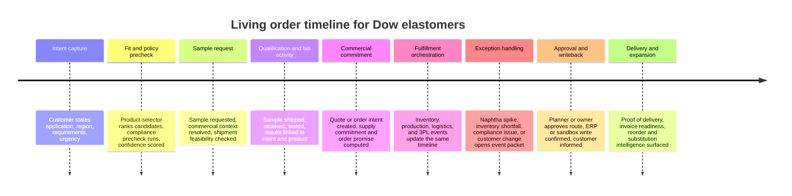
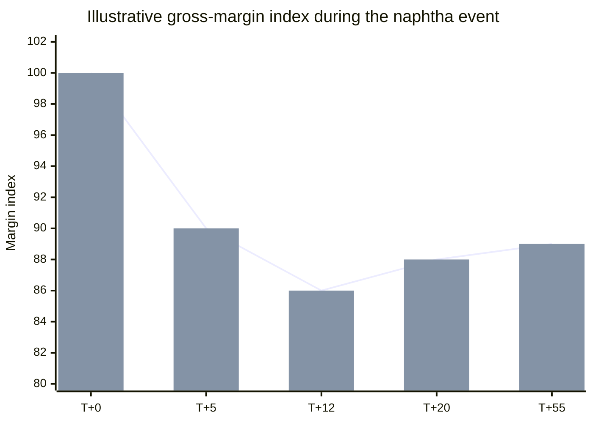
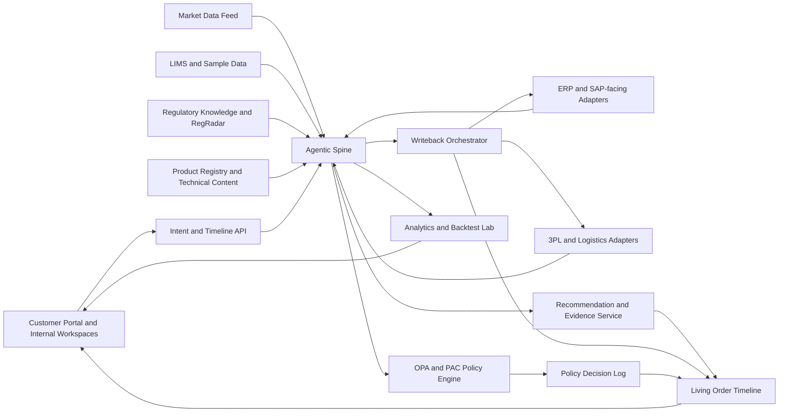
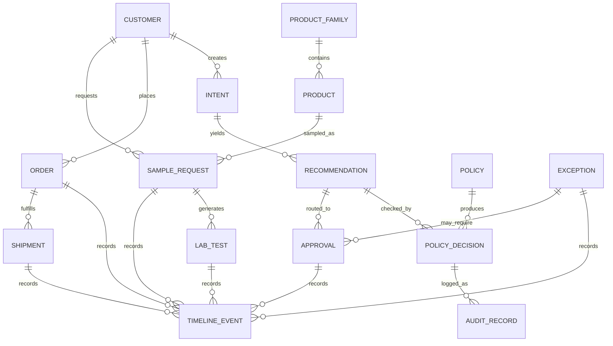

# Reimagining Dow’s Agentic Sales-to-Order, Sample-to-Ship, and Order-to-Delivery Experience

## Executive Summary

Dow does not need a better search box, a prettier sample form, or an isolated assistant bolted onto the portal. The research points to a different answer: Dow needs a governed **agentic spine** that sits between customer intent and enterprise execution, continuously coordinating product knowledge, regulatory intelligence, planning signals, policy checks, and human approvals. In Dow’s own supplied materials, the desired future state is an event-driven, customer-centric commercial platform rather than a fragmented ERP transaction chain, while the KAF/PAC supply-chain concept frames the same principle operationally: small focused agents, policy checked every time, one evidence trail, and planner sign-off where needed. fileciteturn0file6 fileciteturn0file7 fileciteturn0file1

The strongest product direction is therefore **one shared operating model** with three visible surfaces: a customer-facing intelligence layer inspired by ChemAssist, a governed regulatory and policy layer inspired by RegRadar plus OPA/PAC, and an operational orchestration layer for planning, inventory, cost, and fulfillment. This is also consistent with current enterprise orchestration platforms, which now explicitly position themselves as tools to orchestrate AI agents, people, and systems with approvals, escalation paths, and auditability embedded into the process rather than added after the fact. fileciteturn0file7 citeturn40view0turn42view0

The current Dow customer experience, based on the screenshots you provided, is structurally fragmented: discovery happens in search and catalog pages, sample capture happens in separate cart and form flows, identity and registration branch the journey midstream, and confirmation happens by email. The user can move through pages, but not through a **single living order timeline** that explains what is happening, why it is happening, who owns the next step, which policy gates are active, or what alternatives exist if supply, compliance, or pricing conditions change. That fragmentation is exactly what the supplied O2C and ChemAssist materials identify as the core problem: manual coordination, reactive exception handling, slow technical qualification, and inconsistent customer support across systems and teams. fileciteturn0file6 fileciteturn0file7

For the June 9 demo, the right narrative is not “Dow has an AI assistant.” The right narrative is: **“Dow now has one event-driven, explainable, policy-governed customer and operations experience.”** The anchor scenario should remain the naphtha event exactly as requested: **“A 10% naphtha price spike for a European cracker”** that is detected, traced across affected SKUs, evaluated by policy, written back to enterprise systems in a controlled way, and presented to a human planner through one evidence-rich approval surface. The KAF brief already describes this as a worked example that should move from market signal to ERP commit inside the hour, with planner confirmation or override at the end. fileciteturn0file1

The most important UX move is to make the **living order timeline** the center of the product. Every packet in the system should either write to, read from, or explain the timeline. That means the interface is no longer a sequence of disconnected pages. It becomes a persistent, governed thread that starts with customer intent, continues through product matching and sample handling, extends into lab and fulfillment activity, and remains the single approval and evidence surface when an exception such as the naphtha shock hits. This design is also aligned with OPA’s architecture, where policy decisions can return structured results, use centrally managed bundles, and produce decision logs with policy path, inputs, results, timestamps, and `decision_id` values for traceability. citeturn8view0turn5view1turn9view0

The draft BRD is directionally strong. It already includes a shared AI foundation, Human-in-the-Loop controls, tiered autonomy levels, Policy-as-Code, citations, audit logging, approved system writes, and evidence screens for planners. However, it is still missing several things that become essential if the UX is going to be driven by an agentic spine rather than by loosely connected workflows: a canonical ontology, an event taxonomy for the living timeline, an explicit decision-rights matrix, a formal explainability contract, compensation and rollback rules, retention schedules, and a backtest/replay release gate. Those BRD changes are necessary, not optional, if the demo is meant to look compelling **and** operationally credible. fileciteturn0file0

The practical recommendation is to scope the demo tightly. Use **one product family**, preferably ENGAGE elastomers because the ChemAssist brief already proposes it and the automotive selection guide provides credible technical context; use **one region and one disruption path**, the European naphtha event; use **synthetic but plausible data**; keep system writes in **human-approved or sandbox mode**; and make the centerpiece the single pane timeline, not the chatbot conversation. The best demo is the one where the audience sees one event become one trace, one recommendation set, one policy explanation, and one approval decision. fileciteturn0file7 fileciteturn0file1

## Research Findings and Design Principles

### Prioritized Reference Set

| Priority | Source | What it establishes | Design implication |
|---|---|---|---|
| Highest | Dow supply-chain KAF/PAC brief fileciteturn0file1 | Four-agent model, “one naphtha shock, traced end to end,” bounds in code, one signal pane, planner sign-off, audit as query | Use the naphtha spike as the core demo and make the planner evidence screen the climax |
| Highest | Reimagining the Order-to-Cash document fileciteturn0file6 | Dow’s opportunity is to move from fragmented ERP chains and manual coordination to event-driven orchestration around customer journeys | Design around customer intent, supply commitment, visibility, and exception handling rather than around pages or modules |
| Highest | Dow AI Concept Briefs for ChemAssist and RegRadar fileciteturn0file7 | Customer-facing AI, regulatory intelligence, citations, escalation, multilingual support, product selector, order intelligence | Make ChemAssist + RegRadar + spine one governed product, not separate pilots |
| Highest | OPA core docs, bundles, decision logs, policy testing citeturn8view0turn5view1turn9view0turn44view0 | Policy should be decoupled from application logic; policies/data can be shipped as bundles; decisions can be logged with inputs/results/revisions; tests can be automated | PAC/OPA should govern recommendation, action level, explanation, and auditability |
| High | FDA Part 11 guidance and CFR access pages citeturn25view1turn25view0 | Electronic records design should account for validation, audit trail, retention, retrieval, and controlled access | Treat lab/sample/order evidence as durable regulated records even in a demoed synthetic system |
| High | Dema official site citeturn23view0turn23view1 | One AI agent over a unified commerce-native data model, real-time data unification, one-click actions, scenarioing | The experience should combine insight and action in the same pane, not split analytics from workflow |
| High | Camunda official site citeturn40view0 | Agentic orchestration should handle agents, people, and systems together, with policies, approvals, and escalation paths built into the process | Dow’s spine should orchestrate from the outside and inject governance from the inside |
| High | UiPath official site citeturn42view0 | “Agents think, robots do, people lead”; orchestration + governance + SAP/manufacturing orientations | Human ownership and policy controls should remain explicit in every controlled action |
| Medium | Explainability in Human-Agent Systems citeturn35academia3 | Explanation should be designed around why, who, what, when, and how | Each packet needs role-specific explanation, not generic transparency text |
| Medium | Explainable ML for Public Policy citeturn32academia4 | Real-world explanation must be tied to the actual use case and audience | Planner, regulator, sales, and customer must each see different explanation layers |
| Medium | Conflict between explainable and accountable algorithms citeturn32academia1 | Explanation does not remove accountability; governance and human ownership still matter | Keep decision rights explicit; never let the interface imply the agent “owns” the responsibility |
| Medium | Policy-as-Code adoption study citeturn35academia0 | Policy-as-Code is increasingly used for governance and control, including adjacent MLOps contexts | Make BRD policy inventory, versioning, and testing first-class deliverables |

### What the research says, in product terms

The supplied O2C artifact is clear on a foundational point: Dow should organize around **journeys** like quote-to-order, configure-to-commit, deliver-to-promise, and dispute-to-resolution, not around ERP modules. It explicitly calls for an orchestration layer that becomes the “brain” of O2C and coordinates ERP, manufacturing, logistics, finance, CRM, and transportation systems. That is the right conceptual home for the agentic spine. fileciteturn0file6

The KAF/PAC supply-chain concept supplies the operational counterpart. It defines focused agents for anomaly detection, inventory rebalancing, demand updates, and cost-to-serve recalculation, all acting only within bounds defined by finance, trade compliance, plant SOPs, and product rules. It also defines the most powerful demo motion in the entire corpus: a single upstream event creating downstream effects across cost, inventory, demand planning, ERP, and governance, finishing in a human sign-off view with the full trail attached. fileciteturn0file1

OPA is a good fit for that governance layer because it is explicitly designed to **decouple policy decision-making from policy enforcement**, evaluate structured JSON input, return arbitrary structured outputs, distribute policy/data through bundles, and emit detailed decision logs containing queried path, input, result, bundle revision, requester, timestamp, and unique decision IDs. OPA also supports masking sensitive data in decision logs and automated testing through `opa test`, which matters directly for the backtest and release gate this design needs. citeturn8view0turn5view1turn9view0turn44view0

The ChemAssist and RegRadar concept briefs are valuable because they show Dow’s AI ambition is already bigger than support-ticket deflection. The briefs define a shared data foundation spanning product registry, regulatory documentation, and customer account data; they require grounded answers with citations; and they treat escalation as a deliberate product behavior rather than a failure case. That is exactly the pattern the customer experience should inherit: **agentic when bounded, human when uncertain, always explained.** fileciteturn0file7

The most useful outside-market pattern is not “chatbot best practice.” It is the combination of **unified data model + action surface + governed orchestration**. Dema’s official materials emphasize unifying orders, inventory, customers, shipping costs, and other operating data into one model connected to one AI agent, then allowing one-click adjustments and scenarioing from inside the same experience. Camunda and UiPath make a parallel enterprise point from a different angle: agents, robots, and people should be orchestrated in one process with approvals, escalation, governance, and control embedded at runtime. Dow’s opportunity is to bring those patterns into a chemical industry context with a stronger evidence, policy, and retention model. citeturn23view0turn23view1turn40view0turn42view0

### Design principles that should govern the build

| Principle | Practical meaning for Dow | Evidence basis |
|---|---|---|
| Journey before module | Build around intent, sample, qualification, commitment, fulfillment, exception, reorder | fileciteturn0file6 |
| Timeline before page | Every state change becomes an event on one living order timeline | fileciteturn0file1 |
| Policy before action | Every recommendation and writeback is evaluated against PAC/OPA before execution | citeturn8view0turn9view0 |
| Explanation before trust | Show rationale, assumptions, policy reason chain, evidence, confidence, and next owner | citeturn35academia3turn32academia4turn32academia1 |
| Human authority stays visible | The planner, regulatory owner, finance owner, and sales owner remain the named approvers | fileciteturn0file1 citeturn42view0 |
| Action and insight stay together | Recommendation panels must support immediate approve, route, compare, or backtest actions | citeturn23view1turn40view0 |
| Narrow pilot, open spine | One product family, one region, one disruption type, one evidence model, one policy inventory | fileciteturn0file1 fileciteturn0file7 |

### Source limitations

Specific official SAP Business Accelerator Hub pages, named 3PL API documentation, and directly accessible LIMS vendor standards were not reliably retrievable in this research session. The architecture below therefore uses **pattern-based enterprise adapters** for SAP, ERP, 3PL, and LIMS interfaces rather than naming specific SAP endpoints. That is sufficient for UX and operating-model design, but the final technical solution should still be validated against Dow’s actual SAP landscape, integration middleware, and logistics providers.

## Target Operating Model and Living Journey

### Personas and responsibilities

| Persona | Primary goal | What they decide | What the system should do for them | Success metric |
|---|---|---|---|---|
| Sales | Convert interest into sample, quote, and order without losing technical context | Whether to engage, escalate, or accelerate an account | Surface account context, intent history, supply risk, alternatives, and next-best action | Faster qualification, higher sample-to-opportunity conversion |
| Lab and Technical Service | Help customers qualify materials and interpret test/formulation issues | Whether guidance is documented, needs new testing, or must escalate | Provide grounded answers, retrieved document evidence, sample history, and a reusable escalation packet | Lower repeat work, faster response, higher first-time-right guidance |
| Planner | Maintain service, margin, and inventory under changing conditions | Approve, reject, or override rebalancing and sourcing actions | Show cause, impact, policy status, writebacks, and customer exposure in one approval surface | Lower time-to-resolution, lower override of bad recommendations |
| Digital Ops | Keep the agentic spine healthy and observable | Tooling, routing, monitoring, release gates | Own system health, event integrity, packet states, and audit completeness | SLA, incident rate, packet completion, decision-log coverage |
| Revenue Ops | Protect revenue realization and process consistency | Which pathways standardize, which exceptions route | Tie sample, quote, commitment, and order states into one measurable flow | Lower revenue leakage, higher touchless rate |
| Compliance and Regulatory | Ensure answers and actions stay within approved bounds | Whether a response/action is permitted, denied, or routed | Maintain rules, disclaimers, approvals, and auditability | Fewer compliance escapes, faster policy review |
| Agentic spine | Detect, recommend, route, and execute bounded work | None; agents propose within policy and autonomy tier | Generate structured recommendations, policy requests, evidence packets, and write proposals | Decision latency, explainability quality, policy adherence |

The customer personas in the provided elastomers materials also support this operating model. Dow elastomers are sold to manufacturers, converters, OEMs, and formulators, while the frequent sample requesters are materials engineers, product development engineers, R&D scientists, and technical managers trying to answer whether a Dow elastomer is suitable and can be qualified quickly enough for production. That makes the sample-to-qualification transition a first-class product journey, not an afterthought. 

### Living order timeline

### Phase model with owners, agents, and data sources

| Phase | Primary owner | Agent role | Core data sources | What appears on the living timeline |
|---|---|---|---|---|
| Intent capture | Customer / Sales | Parse need, infer product family, detect missing constraints | Customer profile, product registry, application taxonomy | Intent, extracted requirements, confidence, unanswered questions |
| Fit and policy precheck | ChemAssist / Technical Service | Rank products, explain rationale, run customer-facing policy | Product docs, TDS/SDS, regulatory docs, account permissions | Candidate list, rationale, policy visibility, next actions |
| Sample request | Sales / Customer Ops | Validate sample eligibility and shipping feasibility | Account status, sample policy, geography, inventory snapshot | Sample created, owner assigned, commitments, ETA estimate |
| Qualification and lab activity | Lab / Technical Service | Link sample to methods, results, and formulation guidance | LIMS, test methods, sample IDs, technical notes | Sample receipt, test run, result, issue, recommendation |
| Commercial commitment | Sales / RevOps | Compute supply-aware commit and risk | ERP, forecast, inventory, contracts, pricing bounds | Promise date, risk note, alternatives, required approvals |
| Fulfillment orchestration | Planner / Supply Chain | Rebalance, route, or re-source within policy | ERP, SAP-facing adapters, WMS/TMS, 3PL events | Shipment state, source changes, delays, proof artifacts |
| Exception handling | Planner / Compliance | Detect anomaly, recompute impact, open packet | Market feed, cost model, policy engine, customer commitments | Exception raised, affected SKUs, margin exposure, options |
| Approval and writeback | Named human approver | Present recommendation, route for sign-off, record override | OPA decision results, ERP adapters, audit log | Approve/reject/override, write confirmation, reason chain |

This phase model turns the “single source of truth” goal into something operational: the source of truth is not one database table. It is an **evented timeline** whose state is derived from authoritative systems plus agent output, with policy and approval metadata attached to every controlled action. That is the model the KAF/PAC brief implies, and it matches OPA’s ability to log policy query path, result, revision, and decision identifier for each decision. fileciteturn0file1 citeturn9view0

### Illustrative margin-impact chart for the naphtha demo

The chart below is synthetic demo data, designed only to visualize the rhythm of the scenario described in the KAF brief.

Interpretation for presenters: the initial naphtha spike creates immediate margin pressure, the cost agent quantifies the exposure, policy evaluation constrains possible responses, and approved inventory/sourcing changes begin partial recovery before planner sign-off finalizes the response. The point of the chart is not the exact number; it is the **compressed decision cycle** from event to bounded action. fileciteturn0file1

## UX Packet Specifications

### Packet overview

| UX packet | Primary users | Purpose | Core fields and data | Required API events | Sample screen description |
|---|---|---|---|---|---|
| Intent Capture | Customer, Sales | Turn a natural-language need into a structured, explainable case | Customer/account, application, region, performance constraints, compliance needs, urgency, prior orders, known docs | `intent.captured`, `requirements.normalized`, `customer.context.loaded`, `candidate.search.started` | A split screen: left side conversation or structured intake; right side “What we understood” chips, missing requirements, product family inference |
| Policy Transparency | Customer, Planner, Compliance | Show why a recommendation or action is allowed, denied, or routed | Policy domain, action tier, relevant rule text, source document version, decision result, reason chain, confidence | `policy.check.requested`, `policy.check.returned`, `policy.reason.chain.logged`, `policy.visibility.rendered` | A compact card stack that says what rule was checked, which version was used, what changed the result, and who owns escalation |
| Orchestration Screen | Planner, Digital Ops, RevOps | Provide the single pane timeline for the entire case | Timeline events, owners, status, affected SKUs, impacted customers, upstream/downstream dependencies, writeback status | `timeline.event.appended`, `state.transitioned`, `integration.write.proposed`, `integration.write.confirmed`, `owner.reassigned` | A center timeline with event cards, a right-side impact summary, and a footer showing “next decision needed” |
| Agent Recommendation Panel | Planner, Sales, Technical Service | Present recommendations with explanation and action options | Recommendation set, expected service/margin effect, confidence, assumptions, alternatives, supporting sources | `recommendation.generated`, `impact.simulated`, `confidence.scored`, `alternative.generated` | A ranked panel with “recommended,” “acceptable,” and “not allowed” tabs plus explicit rationale under each |
| Escalation Packet | Technical Service, Regulatory, Sales, Planner | Freeze and hand off a complete case snapshot to a human expert | Packet ID, owner, SLA, customer context, source docs, recommendation history, policy results, unresolved questions | `escalation.created`, `packet.snapshot.frozen`, `owner.assigned`, `sla.started` | A packet view designed like a case file: summary, attachments, key decisions, policy checks, questions to answer |
| Exception Workspace | Planner, Compliance, Digital Ops | Resolve unusual events such as supply shock, shortage, or policy conflict | Exception type, severity, blast radius, impacted orders, customer commitments, route history, override controls | `exception.opened`, `severity.updated`, `override.requested`, `customer.notice.sent` | A war-room view with exceptions on the left, selected case in center, corrective options on the right |
| Backtest Lab UI | Digital Ops, Compliance, Product Owner | Replay scenarios and test policies, prompts, and actions before production | Scenario library, replay input, policy bundle versions, model parameters, diff reports, pass/fail status | `scenario.loaded`, `replay.executed`, `policy.test.run`, `decision.diff.generated` | A simulation workspace with scenario selector, timeline replay, side-by-side policy versions, and pass/fail indicator |

### Detailed packet requirements

#### Intent Capture

The intent packet should replace the current browse-and-form pattern with a structured understanding step. Instead of asking the user to know Dow’s taxonomy up front, the system should infer it and then **show its inference back to the user**. The packet should normalize application, performance, geography, compliance needs, and buying stage, and should immediately indicate what missing fields prevent the system from making a confident recommendation. This directly follows the ChemAssist concept, which centers natural-language product selection and formulation support, and the elastomers operating model, which argues for organizing around customer discovery, sampling, and qualification rather than around departmental steps. fileciteturn0file7

Suggested UI copy:
- **“Here’s what I understood about your need.”**
- **“I can recommend products now, but I still need your target region and application temperature range.”**
- **“I am using approved technical and regulatory content only.”**

#### Policy Transparency

Policy transparency should not be buried in an audit log. It should be a visible packet because the system’s credibility depends on showing why it did or did not permit an action. OPA is especially useful here because policy outcomes are not limited to yes/no results and decision logs can carry the policy path, input, result, revision, timestamp, and a unique decision identifier. That means the UI can expose a compact reasoning layer without pretending the model “just knows.” citeturn8view0turn9view0

Suggested UI copy:
- **Allowed** — “This action is within the approved working-capital and customer-commitment bounds for the selected region.”
- **Routed for approval** — “This action affects cross-plant allocation and requires planner review under the current policy version.”
- **Not allowed** — “This action would breach a margin-floor or compliance rule. I can show alternatives.”

#### Orchestration Screen

This is the most important internal screen in the build. It is the visual home of the agentic spine and should become the **single pane of truth order timeline**. The KAF brief already defines the right end state: ERP, MES, logistics, and market feeds in one view, anomalies surfaced when they happen, and planner review on a single screen showing cause, which agents acted, PAC checks, and every ERP write. fileciteturn0file1

Screen structure:
- **Header:** case ID, customer/account, product family, geography, current state
- **Center rail:** event timeline
- **Right rail:** impact summary, policy status, approvals needed, SLA clock
- **Bottom rail:** actions available now, alternatives, linked escalation packet

Suggested UI copy:
- **“One upstream event has changed the plan. Here is the full downstream impact.”**
- **“Nothing has been committed without the policy checks shown below.”**

#### Agent Recommendation Panel

The recommendation panel should behave like a decision brief, not a model output. Each recommendation should include: what changed, what the agent proposes, expected customer/service effect, expected margin or working-capital effect, relevant policies, alternative options, and confidence. This is consistent with the explainability literature, which argues that explanations should be tailored to the user and use case rather than presented as generic transparency. citeturn35academia3turn32academia4

Suggested UI copy:
- **“Recommended because it protects margin while preserving the promise date for strategic customers.”**
- **“Alternative B is lower cost but breaches the current EU trade routing rule.”**
- **“Confidence is moderate because one required inventory feed is delayed by 7 minutes.”**

#### Escalation Packet

Escalation should feel like a premium behavior, not a dead end. The packet should freeze the state of the case at the moment of handoff so the human recipient gets the exact context, evidence, and open question set. ChemAssist already defines escalation as an expected route for low-confidence or non-documented questions, with conversation history and supporting materials attached. fileciteturn0file7

A sample escalation packet should include the following:

| Field | Example value |
|---|---|
| Packet ID | `ESC-ENGAGE-EU-0041` |
| Routed to | Technical Service Europe |
| SLA | 4 business hours |
| Original intent | “Need ENGAGE-grade for automotive dashboard component in hot climate market” |
| Recommendation state | Two qualified products, one blocked by policy, one pending sample lead-time confirmation |
| Source set | TDS, application guide, regulatory note, prior account order history |
| Policy result | Routed because customer-specific commitment check requires human review |
| Open questions | Heat resistance threshold, target production volume, preferred shipping window |
| Attachments | Chat transcript, candidate comparison, policy card, sample cart contents |

Suggested UI copy:
- **“I’m routing this to Technical Service because the required guidance is not fully documented in approved sources.”**
- **“Everything I used to get here is attached below.”**

#### Exception Workspace

This workspace is where the naphtha scenario should land. It is not a generic dashboard. It is a decision room for active disruptions and should group cases by **economic and customer blast radius**, not by raw alert count. The point is to show that the platform sees the exception as a connected business event, not as a collection of alerts. That matches the KAF framing that a feedstock shock should propagate through cost, inventory, forecast, ERP updates, and planner sign-off as one connected sequence. fileciteturn0file1

Suggested UI copy:
- **“This exception affects 14 SKUs, 3 plants, and 2 strategic customer commitments.”**
- **“The current recommended route stays within policy. Two alternatives do not.”**

#### Backtest Lab UI

The backtest lab is critical because the BRD is trying to become the source of business behavior for an agentic system. OPA’s bundle distribution, decision logs, and policy testing model are a natural fit for a replay and comparison surface. The backtest lab should allow teams to replay the same event under different policy versions, confidence thresholds, and routing logic and then inspect the diffs before release. citeturn5view1turn9view0turn44view0

Suggested UI copy:
- **“Replay complete. Policy v1.6 routes to planner; policy v1.7 allows bounded execution.”**
- **“Three outputs changed between bundles. Margin effect improved; customer-risk exposure worsened.”**

## BRD and Governance Model

### Recommended BRD outline

| BRD section | What it must contain |
|---|---|
| Business outcomes | CX, cycle-time, working-capital, revenue-leakage, and audit goals |
| Journey scope | Intent-to-sample, sample-to-qualification, qualification-to-commit, commit-to-delivery, exception-to-resolution |
| Canonical ontology | Customer, account, site, product family, SKU, application, sample, test, policy, recommendation, commitment, shipment, exception, approval, decision log |
| Event model | Timeline event taxonomy, payloads, source systems, ordering guarantees, idempotency, replay semantics |
| Policy model | PAC inventory, rule ownership, versioning, allow/deny/route semantics, action tiers |
| Decision rights | Named approvals by domain, action thresholds, emergency override path |
| Explainability contract | What must be shown to customer, planner, regulator, and ops for every answer or action |
| Data contracts | Authoritative systems, SLAs, quality indicators, confidence rules, lineage |
| Identity and access | RBAC/ABAC model, account context, geography and customer-specific constraints |
| Audit and retention | Required logs, retention periods, evidentiary snapshots, immutable identifiers |
| Backtest and release | Scenario replay, policy tests, prompt tests, fail criteria, rollback rules |
| Operating model | Product owner, policy owner, regulatory owner, digital ops, runtime support |

### BRD compliance checklist

The checklist below evaluates the current draft BRD against the agentic workflow you requested.

| Topic | Status in current BRD | Assessment | Required change |
|---|---|---|---|
| Shared AI foundation | Present | Strong | Keep |
| PAC / policy layer | Present | Strong | Keep |
| Tiered autonomy model | Present | Strong | Keep; use as demo framing |
| Human approval and override | Present | Strong | Keep |
| Audit logging and evidence screens | Present | Strong | Keep |
| Confidence thresholds and escalation | Partial | Present conceptually, not fully operationalized across packets | Add packet-level explanation + escalation rules |
| Canonical ontology | Missing | BRD describes domains but does not define a working ontology | Add ontology appendix and canonical entity definitions |
| Decision-rights matrix | Missing | Approval boundaries are mentioned, but not exhaustively mapped to actions | Add named matrix by action, domain, threshold, and approver |
| Timeline event taxonomy | Missing | The “single pane” depends on a canonical event model not yet specified | Define event classes, source IDs, timestamps, replay semantics |
| Explainability contract | Missing | Rationale is present, but no formal contract for what must be shown by persona | Add mandatory explanation schema for every packet |
| Compensation and rollback | Missing | Controlled writebacks need undo and exception semantics | Add compensation-event and rollback requirements |
| Retention schedule | Missing | BRD asks the question but does not answer it | Add retention categories for prompts, answers, decisions, and attachments |
| Backtest lab and replay acceptance | Partial | Testing exists, but replay and release gating are not fully defined | Add scenario replay, differential review, and promotion criteria |
| Sample-to-ship packet model | Partial | Sample and technical support are in scope, but packetization is not defined | Add packet definitions and timeline events for sample journey |
| LIMS integration contract | Partial | LIMS-equivalent lab workflow is implied, not structured | Add sample/test/result entities, identifiers, and evidence rules |
| Data quality/confidence model | Partial | Metrics are referenced, but confidence and freshness are not formalized | Add field-level freshness, source quality, and confidence handling |

### Required BRD changes

The following BRD changes are the most important and should be made explicitly before design freeze:

| Required change | Why it is necessary | Suggested BRD addition |
|---|---|---|
| Add a canonical ontology | The spine cannot govern what it cannot name consistently | “Appendix A: Ontology and canonical entities” |
| Add a decision-rights matrix | Explainability requires visible ownership, not just policy evaluation | “Appendix B: Decision rights by action tier and domain” |
| Add a timeline event schema | The single pane requires event consistency across customer, lab, ERP, and policy layers | “Appendix C: Event taxonomy and payload contracts” |
| Add an explainability contract | Different users need different explanations for the same decision | “Appendix D: Role-based explanation requirements” |
| Add compensation and rollback rules | Controlled actions must be reversible or explicitly non-reversible | “Appendix E: Writeback safety and recovery semantics” |
| Add retention and evidence policy | Sample, regulatory, and operational records need durable handling | “Appendix F: Retention and evidence classes” |
| Add backtest lab gating | Agentic releases need more than happy-path testing | “Appendix G: Replay, policy diff, and release gates” |

### Recommended decision-rights matrix

| Action | Default level | Approver | Threshold / condition |
|---|---|---|---|
| Customer-facing product recommendation from approved docs | Level 0 or 1 | None | Allowed when source-backed and non-account-specific |
| Sample request under standard rules | Level 2 | Sales Ops or Customer Ops | Required when any routing, hazmat, or account exception exists |
| Regulatory informational answer | Level 0 | None | Allowed only with approved source and disclaimer |
| Formal compliance certification | Level 4 | Regulatory / Legal outside agentic flow | Always prohibited in assistant |
| Inventory rebalance within a single region under margin and working-capital bounds | Level 2 moving to Level 3 later | Planner | May become bounded auto-action after proven controls |
| Cross-border re-source or covenant-sensitive change | Level 2 | Planner + Compliance | Always requires human approval in MVP |
| ERP write affecting supply commitment | Level 2 | Planner | MVP should remain human-approved or sandboxed |
| Pricing negotiation or contract change | Level 4 | Commercial process only | Prohibited in MVP |

## Technical Architecture and Demo Storyboard

### Architecture flow

The key idea is architectural, not visual: the timeline API is the assembly point; the agentic spine performs detection, simulation, and recommendation; OPA/PAC determines action tier and returns explanation-ready policy output; the writeback orchestrator commits only permitted actions; and every state transition writes back to the living order timeline. This mirrors both the Dow/KAF packet and the OPA decision-log model. fileciteturn0file1 citeturn9view0turn5view1

### Canonical entity model

### Demo storyboard for the naphtha spike

| Step | What happens in the system | What the audience sees | Why it matters |
|---|---|---|---|
| Event detected | Market feed posts a 10% naphtha price spike for a European cracker | A new event card appears on the timeline, linked to affected region and product family | Shows event-driven architecture |
| Anomaly packet opens | Anomaly agent opens a traceable exception packet | “What changed” panel with source timestamp, affected plants, initial severity | Shows the spine starts from evidence, not chat |
| Cost recomputation | Cost agent recalculates margin and cost-to-serve across dependent SKUs | Margin impact panel and a ranked exposure list | Makes economics visible immediately |
| Policy evaluated | OPA/PAC checks working-capital bounds, trade rules, plant constraints, and customer commitments | A policy card returns allow/deny/route plus rule provenance and policy version | Makes guardrails visible and trustworthy |
| Rebalance proposed | Inventory agent proposes transfer and sourcing alternatives | Recommendation panel shows recommended action, alternatives, and blocked options | Demonstrates bounded agentic reasoning |
| Writeback prepared | System prepares ERP or sandbox write package | “Ready to commit” packet with exact changed fields | Demonstrates enterprise execution without black box behavior |
| Planner sign-off | Human approves, rejects, or overrides | Single approval screen with cause, actions, policy checks, writebacks, and projected effects | Keeps accountability with the human owner |
| Customer-facing effect | If needed, portal timeline updates or sales packet is created | Proactive customer note or routed sales action appears | Shows CX and ops are one system, not two systems |

### One-page presenter script

| Scene | Presenter line |
|---|---|
| Opening | “This demo is not a chatbot demo. It is a governed decision-system demo.” |
| Scene one | “A market signal arrives: naphtha is up 10% in two hours for a European cracker. The system opens one traceable event.” |
| Scene two | “The agentic spine computes blast radius: affected SKUs, expected margin change, at-risk commitments, and alternative stock positions.” |
| Scene three | “Before anything happens, PAC evaluates the action against finance, compliance, plant, and customer rules. The audience can see the exact reason chain.” |
| Scene four | “The system now proposes the best in-bounds response. Notice that the blocked options are visible too. This is explainability, not just recommendation.” |
| Scene five | “The planner sees one pane: event, impact, policy proof, and proposed writebacks. They can approve, reject, or override.” |
| Scene six | “After approval, the same timeline updates internal execution and customer-facing communication. One signal, traced end to end.” |

## Roadmap, Rehearsal, Risks, and KPIs

### Implementation roadmap to the June 9 demo

| Date | Milestone | Owners | Exit criterion |
|---|---|---|---|
| June 1 | Scope freeze and narrative lock | Product lead, design lead, planner lead | One product family, one region, one event, one approval path agreed |
| June 2 | Ontology, packet schema, and timeline event model frozen | Product, architecture, design | Canonical entities and event names signed off |
| June 2 | Policy inventory for demo frozen | Compliance, finance, planner | Allow/deny/route rules identified for naphtha scenario |
| June 3 | UX packet prototypes complete | Design, product | All seven packet specs reviewed with owners |
| June 3 | Synthetic data and scenario fixtures complete | Engineering, analytics | Replayable dataset available for demo and backtest |
| June 4 | Rehearsal with presenter script | Full team | End-to-end demo runs without narrative gaps |
| June 5 | Policy tuning and evidence copy refinement | Compliance, product, design | Policy explanation copy approved |
| June 6 | Backtest lab pass and fallback recording captured | Engineering, digital ops | Working demo + recovery video available |
| June 8 | Executive polish and final dry run | Leadership, presenters | Runtime stable, timing stable, ownership clear |
| June 9 | Live demo | Presenters | Demonstration lands in under 12 minutes |

### Backtest lab gating criteria

| Gate | Minimum requirement for demo readiness |
|---|---|
| Grounding | Every recommendation and answer references approved source material |
| Policy completeness | Every controlled action returns allow, deny, or route with visible reason chain |
| Replayability | Naphtha event can be replayed end to end using the same synthetic fixture |
| Decision logging | Each policy check receives a unique decision reference and timestamp |
| Human control | Planner can approve, reject, and override without dead ends |
| Audit completeness | Timeline shows event, recommendation, policy result, and final action |
| Failure handling | If an integration mock fails, the system degrades to recommendation-only mode |
| Demo recovery | Recorded backup run exists and uses identical dataset and slides |

OPA’s testing and decision-log features strongly support these gates. Policies can be tested automatically and emitted in structured formats, while decision logs can preserve the data needed for replay and audit. citeturn44view0turn9view0

### Principal risks and recommended mitigations

| Risk | Why it matters | Mitigation |
|---|---|---|
| The demo becomes “chat-first” instead of “timeline-first” | Audience remembers AI veneer, not operational credibility | Center every scene on the living timeline and approval surface |
| Policy reasons are too abstract | Trust collapses if viewers cannot see concrete rule provenance | Use source-linked policy cards with plain-language rationale |
| Synthetic data feels fake | Enterprise audiences reject demos with impossible numbers | Use plausible but modest synthetic data and expose assumptions |
| Sample journey remains disconnected from order journey | CX promise looks incomplete | Use one case/thread ID across intent, sample, test, and order packets |
| Too much autonomy too early | Raises credibility and control concerns | Keep MVP at Level 0–2 only, with writebacks sandboxed or human-approved |
| No crisp host narrative | Demo looks technically busy but conceptually fuzzy | Repeat one sentence: “One event, one timeline, one policy proof, one approval surface.” |

### Recommended KPIs

| KPI | Definition | Why it matters |
|---|---|---|
| Revenue leakage prevented | Value of saved commitments, substitutions, or avoided margin erosion from controlled interventions | Links spine to commercial impact |
| Override rate | Share of agent recommendations rejected or altered by humans | Measures trust and recommendation quality |
| Policy deny/route rate | Share of actions blocked or routed by PAC | Measures policy coverage and autonomy readiness |
| Time-to-resolution | Minutes from event detection to approved action | Best indicator for the naphtha storyline |
| SLA adherence | Share of escalations and approvals completed within target | Critical for sales, technical service, and planning trust |
| Sample-to-qualification cycle time | Time from request to sufficient test evidence | Connects CX to lab operations |
| Touchless-answer rate | Share of customer questions answered without human escalation, within policy | Measures ChemAssist value without hiding risk |
| Audit completeness | Share of timeline events with source, owner, timestamp, and decision references | Measures operational legitimacy |
| Decision latency | Time for PAC decision and recommendation rendering | Important for live orchestration feel |
| Customer effort reduction | Steps or interactions required to move from intent to sample or order | Best CX summary metric |

### Open questions and limitations

| Open question | Why it must be answered soon |
|---|---|
| Which exact systems are authoritative for product, account, order, sample, and lab results? | The timeline cannot be credible without authoritative source mapping |
| Which actions may ever become bounded auto-actions at Dow? | Autonomy tier determines architecture, policy scope, and UX language |
| What are the exact retention requirements for prompts, answers, decisions, and attachments? | The audit model is incomplete without retention classes |
| What specific sample and shipping policies differ by region or product hazard class? | Sample-to-ship UX must reflect real operational constraints |
| Which SAP, TMS, and 3PL interfaces will be mocked versus actually integrated? | Demo stability depends on bounded integration scope |
| Which disclaimer language is approved for technical and regulatory responses? | Customer-facing trust depends on precise wording |

The highest-confidence path is therefore straightforward: build the **agentic spine first**, make the **living order timeline** the central interface, operationalize **PAC/OPA** as visible governance rather than invisible plumbing, and use the **naphtha spike** to prove that Dow can connect customer experience, supply-chain response, and explainability in one governed system. That is the clearest, strongest, and most research-backed way to reimagine the experience packet for Dow. fileciteturn0file1 fileciteturn0file6 fileciteturn0file7 citeturn8view0turn9view0turn40view0turn42view0